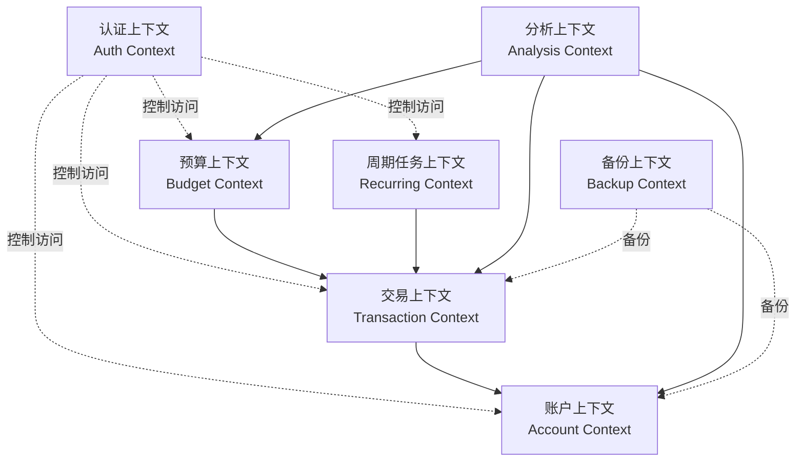
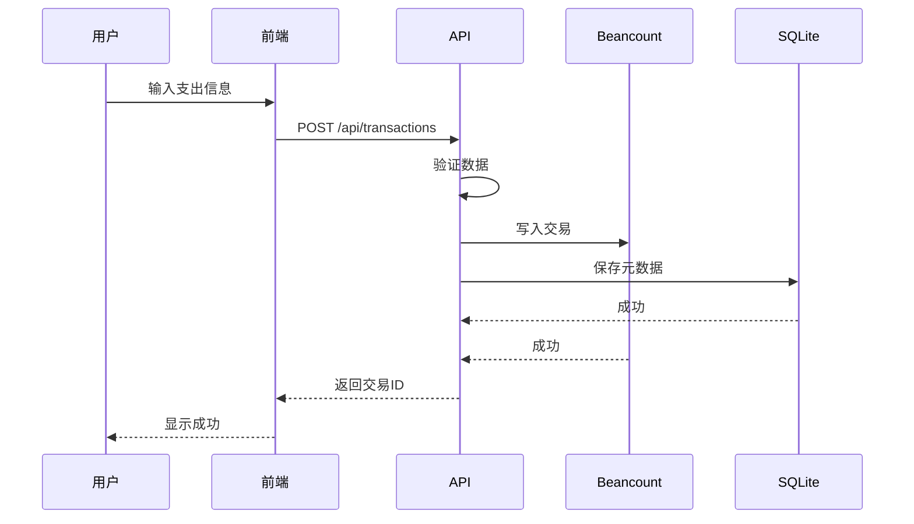
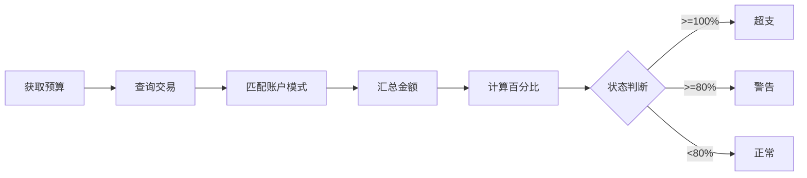

# BeanMind 系统设计总览

## 📋 项目概述

**BeanMind** 是一个基于 Beancount 的个人记账软件，提供完整的财务管理解决方案。

### 核心特性
- ✅ 灵活的鉴权系统（单用户/无用户模式）
- 📝 完整的记账功能（收入/支出/转账）
- 💰 智能预算管理
- 🔄 周期任务自动化
- 📊 数据分析与可视化
- 🤖 AI 财务助手
- 💾 可插拔的数据备份

### 技术栈总结

| 层级 | 技术选型 |
|------|---------|
| 后端语言 | Python 3.10+ |
| Web 框架 | FastAPI |
| 账本引擎 | Beancount |
| 数据库 | SQLite |
| AI 框架 | AgentUniverse |
| 前端框架 | Vue 3 + Framework7-Vue |
| 状态管理 | Pinia |
| 构建工具 | Vite |

## 🏗️ 架构设计

### DDD 领域模型

系统划分为 **7 个限界上下文**：



### 分层架构

```
┌─────────────────────────────────┐
│   接口层 (Interface Layer)      │  ← REST API, DTO
├─────────────────────────────────┤
│   应用层 (Application Layer)    │  ← 业务用例编排
├─────────────────────────────────┤
│   领域层 (Domain Layer)         │  ← 核心业务逻辑
├─────────────────────────────────┤
│   基础设施层 (Infrastructure)   │  ← Beancount, SQLite, 备份提供者
└─────────────────────────────────┘
```

### 数据存储策略

- **Beancount 文件**：账本核心数据（交易、账户、余额）
- **SQLite 数据库**：业务元数据（用户、预算、周期任务、备份历史）
- **环境变量**：系统配置和鉴权信息

## 💾 数据库设计

### SQLite 表结构（7张表）

1. **users** - 用户表
2. **transaction_metadata** - 交易元数据
3. **budgets** - 预算表
4. **budget_items** - 预算项目
5. **recurring_rules** - 周期规则
6. **recurring_executions** - 周期执行记录
7. **backup_history** - 备份历史

### Beancount 文件结构

```beancount
;; 选项配置
option "title" "个人账本"
option "operating_currency" "CNY"

;; 账户定义
2025-01-01 open Assets:Bank:ICBC CNY
2025-01-01 open Expenses:Food:Dining CNY
2025-01-01 open Income:Salary CNY

;; 交易记录
2025-01-15 * "午餐" "餐厅"
  Expenses:Food:Dining     45.00 CNY
  Assets:Cash:Wallet      -45.00 CNY
  #lunch #dining
```

> 📖 完整设计详见：[database_design.md](file:///Users/wangrong/.gemini/antigravity/brain/476218e0-1f76-4c00-be0e-e15c0948b1d2/database_design.md)

## 🔧 功能模块设计

### 1. 鉴权模块（Auth）
- 支持三种模式：无鉴权、单用户、多用户（预留）
- 环境变量配置
- JWT Token 机制

### 2. 记账模块（Transaction）
- 支持支出、收入、转账
- 自动借贷平衡验证
- 标签和分类管理

### 3. 账户管理模块（Account）
- 层级账户结构
- 实时余额查询
- 账户历史统计

### 4. 预算管理模块（Budget）
- 月度/年度/自定义周期
- 账户模式匹配
- 预算预警机制

### 5. 周期记账模块（Recurring）
- 支持每日/每周/每月/每年
- 自动执行引擎
- 执行历史追踪

### 6. 数据备份模块（Backup）
- 可插拔提供者（GitHub、本地、S3...）
- 自动/手动备份
- 一键恢复

### 7. AI 分析模块（Analysis）
- 基于 AgentUniverse
- 消费模式分析
- 财务健康评分
- 自然语言查询

> 📖 完整设计详见：[module_design.md](file:///Users/wangrong/.gemini/antigravity/brain/476218e0-1f76-4c00-be0e-e15c0948b1d2/module_design.md)

## 🔌 API 接口设计

### RESTful API 端点汇总

| 模块 | 主要接口 | 数量 |
|------|----------|------|
| 认证 | `/api/auth/*` | 3 |
| 账户 | `/api/accounts/*` | 5 |
| 交易 | `/api/transactions/*` | 6 |
| 预算 | `/api/budgets/*` | 5 |
| 周期任务 | `/api/recurring-rules/*` | 5 |
| 备份 | `/api/backups/*` | 4 |
| 分析 | `/api/analysis/*` | 4 |

### 统一响应格式

```json
{
  "success": true,
  "data": {},
  "message": null
}
```

> 📖 完整接口规范详见：[api_design.md](file:///Users/wangrong/.gemini/antigravity/brain/476218e0-1f76-4c00-be0e-e15c0948b1d2/api_design.md)

## 📱 前端页面设计

### 页面结构（9个核心页面）

1. **登录页** (`/login`) - 用户认证
2. **仪表盘** (`/`) - 财务概览、快捷操作
3. **记账页** (`/transactions`) - 交易列表、新增编辑
4. **账户页** (`/accounts`) - 账户管理、余额查询
5. **分析页** (`/analysis`) - 图表分析、AI 洞察
6. **预算管理** (`/budgets`) - 预算设置、执行追踪
7. **周期任务** (`/recurring`) - 周期规则管理
8. **数据备份** (`/backup`) - 备份与恢复
9. **更多/设置** (`/more`) - 系统设置

### 底部导航

```
[ 📊 仪表盘 ]  [ 💰 记账 ]  [ 📁 账户 ]  [ 📈 分析 ]  [ ⚙️ 更多 ]
```

### 核心组件

- `AmountInput` - 金额输入
- `AccountPicker` - 账户选择器
- `CategoryPicker` - 分类选择器
- `BudgetProgressBar` - 预算进度条
- `LineChart` / `PieChart` / `BarChart` - ECharts 图表

> 📖 完整页面设计详见：[frontend_design.md](file:///Users/wangrong/.gemini/antigravity/brain/476218e0-1f76-4c00-be0e-e15c0948b1d2/frontend_design.md)

## 🎯 核心流程示例

### 添加支出流程



### 预算执行计算



## 🚀 开发路线图

### 第一阶段：核心功能（MVP）
- [x] 系统设计完成
- [ ] 后端基础框架搭建
- [ ] Beancount 集成
- [ ] 基础 CRUD 接口
- [ ] 前端基础页面
- [ ] 登录与鉴权

### 第二阶段：完整功能
- [ ] 预算管理
- [ ] 周期任务
- [ ] 数据备份（GitHub）
- [ ] 数据分析与图表

### 第三阶段：AI 增强
- [ ] AgentUniverse 集成
- [ ] AI 财务洞察
- [ ] 自然语言查询

### 第四阶段：优化与扩展
- [ ] 性能优化
- [ ] 多币种支持
- [ ] 移动端 PWA
- [ ] 更多备份提供者

## 📚 文档索引

| 文档 | 描述 | 路径 |
|------|------|------|
| 系统架构设计 | DDD模型、分层架构、目录结构 | [system_architecture.md](file:///Users/wangrong/.gemini/antigravity/brain/476218e0-1f76-4c00-be0e-e15c0948b1d2/system_architecture.md) |
| 数据库设计 | SQLite表设计、Beancount结构 | [database_design.md](file:///Users/wangrong/.gemini/antigravity/brain/476218e0-1f76-4c00-be0e-e15c0948b1d2/database_design.md) |
| 功能模块设计 | 7个核心模块详细设计 | [module_design.md](file:///Users/wangrong/.gemini/antigravity/brain/476218e0-1f76-4c00-be0e-e15c0948b1d2/module_design.md) |
| API接口设计 | RESTful API规范 | [api_design.md](file:///Users/wangrong/.gemini/antigravity/brain/476218e0-1f76-4c00-be0e-e15c0948b1d2/api_design.md) |
| 前端页面设计 | 页面布局、组件、交互流程 | [frontend_design.md](file:///Users/wangrong/.gemini/antigravity/brain/476218e0-1f76-4c00-be0e-e15c0948b1d2/frontend_design.md) |
| 实施计划 | 开发计划与验证方案 | [implementation_plan.md](file:///Users/wangrong/.gemini/antigravity/brain/476218e0-1f76-4c00-be0e-e15c0948b1d2/implementation_plan.md) |
| 任务清单 | 详细任务追踪 | [task.md](file:///Users/wangrong/.gemini/antigravity/brain/476218e0-1f76-4c00-be0e-e15c0948b1d2/task.md) |

## 🎨 设计亮点

### 1. 灵活的鉴权策略
通过环境变量配置，支持无鉴权、单用户、多用户三种模式，适应不同部署场景。

### 2. DDD 领域驱动设计
清晰的领域划分和分层架构，易于维护和扩展。

### 3. 数据双轨存储
- Beancount 保证数据准确性和可读性
- SQLite 提供高效查询和业务扩展

### 4. 可插拔架构
- 备份提供者可插拔
- AI 分析可插拔
- 通知渠道可插拔

### 5. 移动端优先
基于 Framework7-Vue，提供原生级移动端体验。

### 6. AI 驱动洞察
集成 AgentUniverse，提供智能财务分析和建议。

## 📝 环境变量配置示例

```bash
# 鉴权配置
AUTH_MODE=single_user
SINGLE_USER_USERNAME=admin
SINGLE_USER_PASSWORD=your-secure-password
JWT_SECRET_KEY=your-secret-key
JWT_EXPIRATION_HOURS=24

# 数据路径
DATA_DIR=./data
LEDGER_FILE=./data/ledger/main.beancount
DATABASE_FILE=./data/beanmind.db

# 备份配置
BACKUP_PROVIDER=github
BACKUP_AUTO_ENABLED=true
BACKUP_AUTO_INTERVAL=daily

GITHUB_REPO=username/beanmind-backup
GITHUB_TOKEN=ghp_xxxxx
GITHUB_BRANCH=main

# AI配置
AI_ENABLED=true
AGENTUNIVERSE_CONFIG=./config/agent_config.yaml
```

## 🔐 安全性考虑

1. **认证**：JWT Token 机制
2. **密码**：bcrypt 加密存储
3. **数据**：SQLite 加密（可选）
4. **备份**：GitHub Private Repo
5. **API**：CORS 配置、请求限流
6. **输入**：Pydantic 验证、SQL 注入防护

## 📊 性能优化策略

1. **后端**
   - Beancount 文件缓存
   - SQLite 索引优化
   - 异步 I/O（FastAPI）

2. **前端**
   - 虚拟滚动（大列表）
   - 路由懒加载
   - 图表按需加载
   - Pinia 状态缓存

## 🎯 下一步行动

根据本设计文档，可以开始：

1. **搭建项目骨架**：创建目录结构
2. **初始化数据库**：执行 SQL 脚本
3. **实现核心领域模型**：Account、Transaction 实体
4. **开发基础接口**：认证、账户、交易 API
5. **构建前端页面**：登录、仪表盘、记账页

---

**文档版本**: 1.0  
**创建日期**: 2025-12-20  
**最后更新**: 2025-12-20  
**维护者**: BeanMind Team
