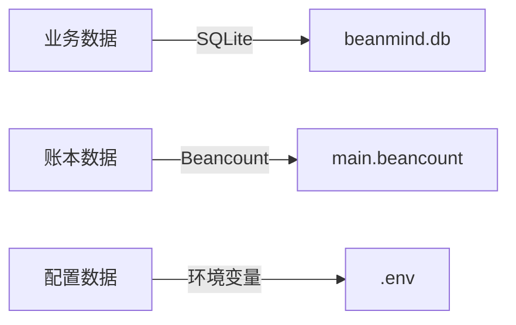
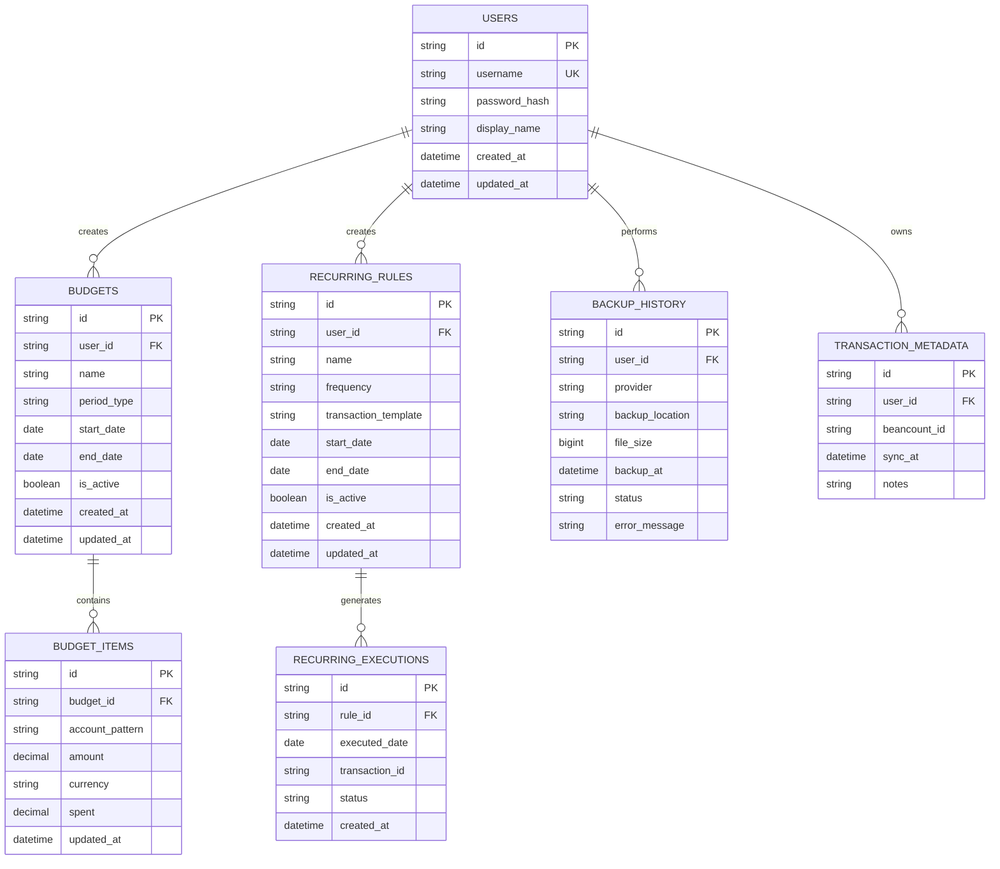
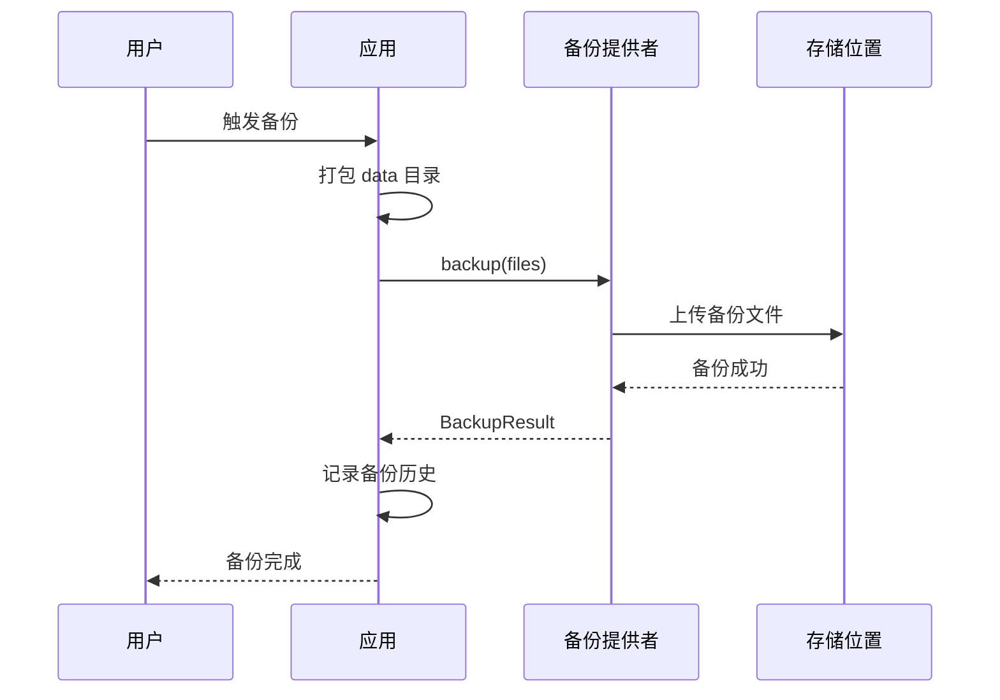
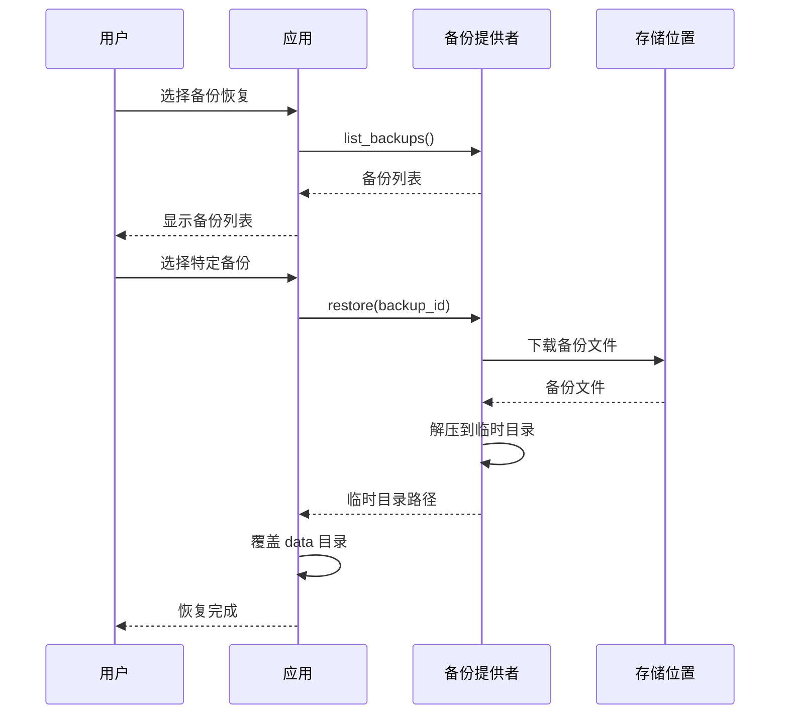

# BeanMind 数据库设计

## 1. 数据存储策略

### 1.1 数据分层存储



**设计原则**：
- **Beancount 文件**：存储所有交易记录、账户定义、商品价格等财务核心数据
- **SQLite 数据库**：存储用户信息、预算规则、周期任务、备份历史等业务元数据
- **环境变量**：存储系统配置、鉴权信息等敏感配置

### 1.2 数据一致性保证

- Beancount 作为数据源头，SQLite 存储辅助信息
- 交易创建时同时写入 Beancount 和 SQLite
- 启动时从 Beancount 重建必要的缓存数据

## 2. Beancount 文件结构

### 2.1 主账本文件（main.beancount）

```beancount
;; ============================================================
;; BeanMind 账本文件
;; 创建时间: 2025-01-01
;; ============================================================

;; ------------------------------------------------------------
;; 选项配置
;; ------------------------------------------------------------
option "title" "个人账本"
option "operating_currency" "CNY"
option "operating_currency" "USD"

;; ------------------------------------------------------------
;; 插件
;; ------------------------------------------------------------
plugin "beancount.plugins.auto_accounts"

;; ------------------------------------------------------------
;; 账户定义
;; ------------------------------------------------------------

;; 资产账户
2025-01-01 open Assets:Cash:Wallet CNY
  description: "现金钱包"
  
2025-01-01 open Assets:Bank:ICBC CNY
  description: "工商银行储蓄卡"
  
2025-01-01 open Assets:Invest:Alipay CNY
  description: "支付宝余额"

2025-01-01 open Assets:CreditCard:ICBC CNY, USD
  description: "工商银行信用卡"

;; 负债账户
2025-01-01 open Liabilities:CreditCard:ICBC CNY, USD
  description: "信用卡负债"

;; 权益账户
2025-01-01 open Equity:OpeningBalances
  description: "期初余额"

;; 收入账户
2025-01-01 open Income:Salary CNY
  description: "工资收入"
  
2025-01-01 open Income:Bonus CNY
  description: "奖金收入"
  
2025-01-01 open Income:Investment CNY
  description: "投资收益"

;; 支出账户
2025-01-01 open Expenses:Food:Dining CNY
  description: "餐饮美食"
  
2025-01-01 open Expenses:Food:Groceries CNY
  description: "食材采购"
  
2025-01-01 open Expenses:Transport:PublicTransit CNY
  description: "公共交通"
  
2025-01-01 open Expenses:Transport:Taxi CNY
  description: "打车出行"
  
2025-01-01 open Expenses:Housing:Rent CNY
  description: "房租"
  
2025-01-01 open Expenses:Housing:Utilities CNY
  description: "水电煤气"
  
2025-01-01 open Expenses:Entertainment:Movies CNY
  description: "电影娱乐"
  
2025-01-01 open Expenses:Shopping:Clothing CNY
  description: "服装购物"
  
2025-01-01 open Expenses:Healthcare:Medical CNY
  description: "医疗费用"
  
2025-01-01 open Expenses:Education:Books CNY
  description: "书籍学习"

;; ------------------------------------------------------------
;; 期初余额
;; ------------------------------------------------------------
2025-01-01 * "期初余额" "初始化账户余额"
  Assets:Bank:ICBC                     10000.00 CNY
  Assets:Cash:Wallet                    1000.00 CNY
  Assets:Invest:Alipay                  5000.00 CNY
  Equity:OpeningBalances              -16000.00 CNY

;; ------------------------------------------------------------
;; 交易记录
;; ------------------------------------------------------------

2025-01-05 * "超市购物" "沃尔玛"
  Expenses:Food:Groceries               235.50 CNY
  Assets:Invest:Alipay                 -235.50 CNY
  #groceries #shopping

2025-01-10 * "工资收入" "公司发薪"
  Assets:Bank:ICBC                    15000.00 CNY
  Income:Salary                      -15000.00 CNY
  #salary #income

2025-01-15 * "午餐" "公司楼下餐厅"
  Expenses:Food:Dining                   45.00 CNY
  Assets:Cash:Wallet                    -45.00 CNY
  #lunch #dining
```

### 2.2 账户命名规范

```
账户类型:一级分类:二级分类:...

账户类型:
  - Assets (资产)
  - Liabilities (负债)
  - Equity (权益)
  - Income (收入)
  - Expenses (支出)

示例:
  - Assets:Bank:ICBC              # 工商银行资产
  - Expenses:Food:Dining          # 餐饮支出
  - Income:Salary                 # 工资收入
```

### 2.3 标签规范

- 使用 `#` 前缀标记标签
- 支持多标签
- 常用标签：`#food` `#transport` `#entertainment` `#recurring` 等

## 3. SQLite 数据库设计

### 3.1 ER 图



### 3.2 表结构详细设计

#### 3.2.1 用户表（users）

```sql
CREATE TABLE users (
    id VARCHAR(36) PRIMARY KEY,              -- UUID
    username VARCHAR(50) UNIQUE NOT NULL,    -- 用户名
    password_hash VARCHAR(255),              -- 密码哈希（可为空，无鉴权模式）
    display_name VARCHAR(100),               -- 显示名称
    created_at TIMESTAMP DEFAULT CURRENT_TIMESTAMP,
    updated_at TIMESTAMP DEFAULT CURRENT_TIMESTAMP
);

CREATE INDEX idx_users_username ON users(username);
```

#### 3.2.2 交易元数据表（transaction_metadata）

```sql
CREATE TABLE transaction_metadata (
    id VARCHAR(36) PRIMARY KEY,              -- UUID
    user_id VARCHAR(36) NOT NULL,            -- 用户ID
    beancount_id VARCHAR(100) NOT NULL,      -- Beancount 中的交易标识
    sync_at TIMESTAMP NOT NULL,              -- 同步时间
    notes TEXT,                              -- 额外备注
    FOREIGN KEY (user_id) REFERENCES users(id) ON DELETE CASCADE
);

CREATE INDEX idx_transaction_metadata_user ON transaction_metadata(user_id);
CREATE INDEX idx_transaction_metadata_beancount ON transaction_metadata(beancount_id);
CREATE INDEX idx_transaction_metadata_sync ON transaction_metadata(sync_at);
```

#### 3.2.3 预算表（budgets）

```sql
CREATE TABLE budgets (
    id VARCHAR(36) PRIMARY KEY,              -- UUID
    user_id VARCHAR(36) NOT NULL,            -- 用户ID
    name VARCHAR(100) NOT NULL,              -- 预算名称
    period_type VARCHAR(20) NOT NULL,        -- 周期类型: MONTHLY, YEARLY, CUSTOM
    start_date DATE NOT NULL,                -- 开始日期
    end_date DATE,                           -- 结束日期
    is_active BOOLEAN DEFAULT TRUE,          -- 是否激活
    created_at TIMESTAMP DEFAULT CURRENT_TIMESTAMP,
    updated_at TIMESTAMP DEFAULT CURRENT_TIMESTAMP,
    FOREIGN KEY (user_id) REFERENCES users(id) ON DELETE CASCADE
);

CREATE INDEX idx_budgets_user ON budgets(user_id);
CREATE INDEX idx_budgets_active ON budgets(is_active);
CREATE INDEX idx_budgets_period ON budgets(start_date, end_date);
```

#### 3.2.4 预算项目表（budget_items）

```sql
CREATE TABLE budget_items (
    id VARCHAR(36) PRIMARY KEY,              -- UUID
    budget_id VARCHAR(36) NOT NULL,          -- 预算ID
    account_pattern VARCHAR(100) NOT NULL,   -- 账户匹配模式，如 "Expenses:Food:*"
    amount DECIMAL(15, 2) NOT NULL,          -- 预算金额
    currency VARCHAR(10) DEFAULT 'CNY',      -- 币种
    spent DECIMAL(15, 2) DEFAULT 0,          -- 已花费金额
    updated_at TIMESTAMP DEFAULT CURRENT_TIMESTAMP,
    FOREIGN KEY (budget_id) REFERENCES budgets(id) ON DELETE CASCADE
);

CREATE INDEX idx_budget_items_budget ON budget_items(budget_id);
```

#### 3.2.5 周期任务规则表（recurring_rules）

```sql
CREATE TABLE recurring_rules (
    id VARCHAR(36) PRIMARY KEY,              -- UUID
    user_id VARCHAR(36) NOT NULL,            -- 用户ID
    name VARCHAR(100) NOT NULL,              -- 规则名称
    frequency VARCHAR(50) NOT NULL,          -- 频率: DAILY, WEEKLY, MONTHLY, YEARLY, INTERVAL
    frequency_config TEXT,                   -- 频率配置（JSON格式）
    transaction_template TEXT NOT NULL,      -- 交易模板（JSON格式）
    start_date DATE NOT NULL,                -- 开始日期
    end_date DATE,                           -- 结束日期
    is_active BOOLEAN DEFAULT TRUE,          -- 是否激活
    created_at TIMESTAMP DEFAULT CURRENT_TIMESTAMP,
    updated_at TIMESTAMP DEFAULT CURRENT_TIMESTAMP,
    FOREIGN KEY (user_id) REFERENCES users(id) ON DELETE CASCADE
);

CREATE INDEX idx_recurring_rules_user ON recurring_rules(user_id);
CREATE INDEX idx_recurring_rules_active ON recurring_rules(is_active);
```

**频率配置示例（frequency_config）**：
```json
// WEEKLY - 按周（周一、周三、周五）
{
  "weekdays": [1, 3, 5]
}

// MONTHLY - 按月（每月1日、15日、月末）
{
  "month_days": [1, 15, -1]
}

// YEARLY - 按年（每年6月18日）
{
  "month": 6,
  "day": 18
}

// INTERVAL - 自定义间隔（每3天）
{
  "interval_days": 3
}

// DAILY - 每日（无需配置）
null
```

#### 3.2.6 周期任务执行记录表（recurring_executions）

```sql
CREATE TABLE recurring_executions (
    id VARCHAR(36) PRIMARY KEY,              -- UUID
    rule_id VARCHAR(36) NOT NULL,            -- 规则ID
    executed_date DATE NOT NULL,             -- 执行日期
    transaction_id VARCHAR(100),             -- 生成的交易ID
    status VARCHAR(20) NOT NULL,             -- 状态: SUCCESS, FAILED, PENDING
    created_at TIMESTAMP DEFAULT CURRENT_TIMESTAMP,
    FOREIGN KEY (rule_id) REFERENCES recurring_rules(id) ON DELETE CASCADE
);

CREATE INDEX idx_recurring_executions_rule ON recurring_executions(rule_id);
CREATE INDEX idx_recurring_executions_date ON recurring_executions(executed_date);
CREATE INDEX idx_recurring_executions_status ON recurring_executions(status);
```

#### 3.2.7 备份历史表（backup_history）

```sql
CREATE TABLE backup_history (
    id VARCHAR(36) PRIMARY KEY,              -- UUID
    user_id VARCHAR(36) NOT NULL,            -- 用户ID
    provider VARCHAR(50) NOT NULL,           -- 备份提供者: github, local, s3
    backup_location TEXT NOT NULL,           -- 备份位置（URL或路径）
    file_size BIGINT,                        -- 文件大小（字节）
    backup_at TIMESTAMP NOT NULL,            -- 备份时间
    status VARCHAR(20) NOT NULL,             -- 状态: SUCCESS, FAILED
    error_message TEXT,                      -- 错误信息
    FOREIGN KEY (user_id) REFERENCES users(id) ON DELETE CASCADE
);

CREATE INDEX idx_backup_history_user ON backup_history(user_id);
CREATE INDEX idx_backup_history_time ON backup_history(backup_at);
CREATE INDEX idx_backup_history_provider ON backup_history(provider);
```

## 4. 数据迁移策略

### 4.1 初始化脚本

```python
# infrastructure/persistence/sqlalchemy/migrations/init_db.py

def init_database(db_path: Path):
    """初始化数据库"""
    engine = create_engine(f"sqlite:///{db_path}")
    Base.metadata.create_all(engine)
    
    # 创建默认用户（无鉴权模式）
    if settings.AUTH_MODE == "none":
        session = Session(engine)
        default_user = User(
            id="00000000-0000-0000-0000-000000000000",
            username="default",
            display_name="默认用户"
        )
        session.add(default_user)
        session.commit()
```

### 4.2 Beancount 文件初始化

```python
# infrastructure/persistence/beancount/init_ledger.py

def init_ledger(ledger_path: Path):
    """初始化账本文件"""
    if not ledger_path.exists():
        template = """
;; BeanMind 账本文件
option "title" "个人账本"
option "operating_currency" "CNY"

;; 默认账户
{open_date} open Assets:Unknown
{open_date} open Equity:OpeningBalances
        """.format(open_date=datetime.now().strftime("%Y-%m-%d"))
        
        ledger_path.write_text(template)
```

## 5. 数据备份与恢复

### 5.1 备份内容

```
data/
├── ledger/
│   └── main.beancount          # 需备份
└── beanmind.db                 # 需备份
```

### 5.2 备份流程



### 5.3 恢复流程



## 6. 数据查询优化

### 6.1 常用查询

```sql
-- 1. 获取某月的所有支出交易
SELECT * FROM transaction_metadata 
WHERE user_id = ? 
  AND DATE(sync_at) BETWEEN ? AND ?
  AND beancount_id IN (SELECT id FROM beancount WHERE account LIKE 'Expenses:%');

-- 2. 获取活跃预算及其执行情况
SELECT b.*, bi.*, 
       (bi.amount - bi.spent) as remaining
FROM budgets b
JOIN budget_items bi ON b.id = bi.budget_id
WHERE b.user_id = ? 
  AND b.is_active = TRUE
  AND b.start_date <= DATE('now')
  AND (b.end_date IS NULL OR b.end_date >= DATE('now'));

-- 3. 获取待执行的周期任务
SELECT * FROM recurring_rules
WHERE user_id = ?
  AND is_active = TRUE
  AND start_date <= DATE('now')
  AND (end_date IS NULL OR end_date >= DATE('now'))
  AND id NOT IN (
      SELECT rule_id FROM recurring_executions 
      WHERE executed_date = DATE('now') AND status = 'SUCCESS'
  );
```

### 6.2 缓存策略

- 启动时加载 Beancount 文件到内存
- 账户余额缓存（定期刷新）
- 交易列表分页查询
- 预算执行情况实时计算
