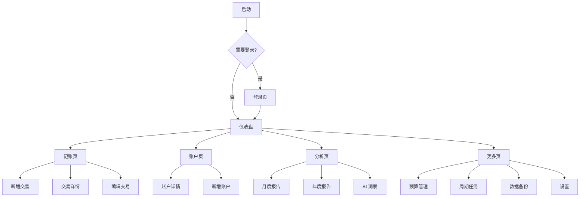
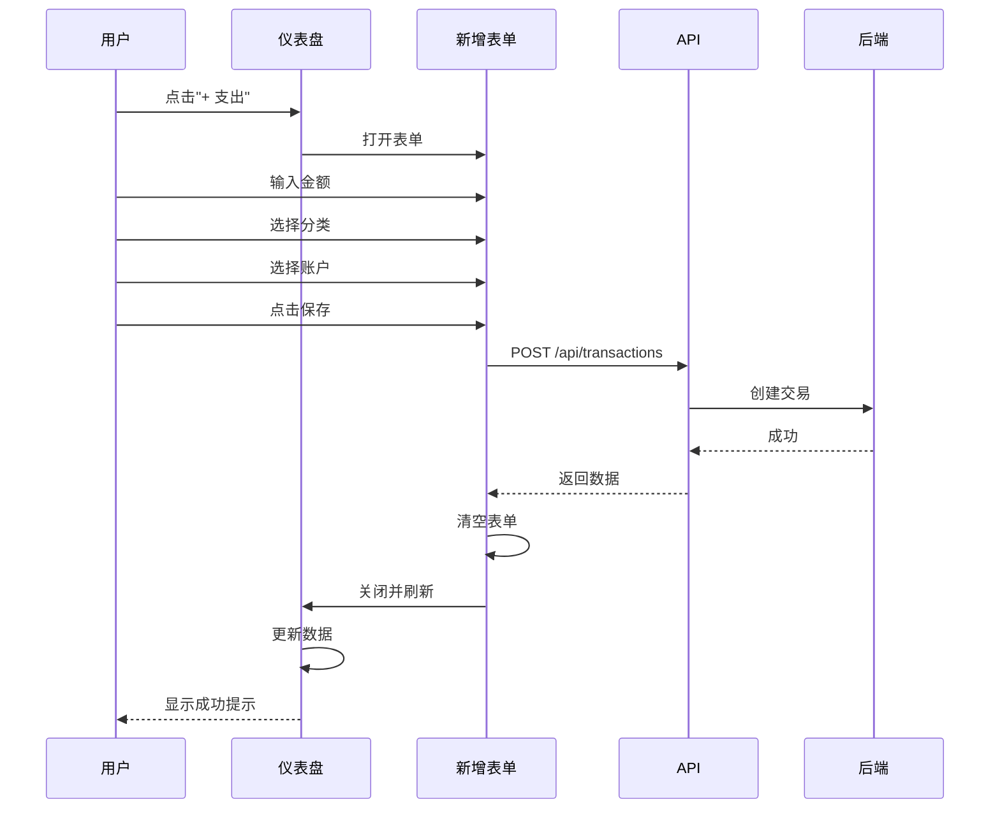
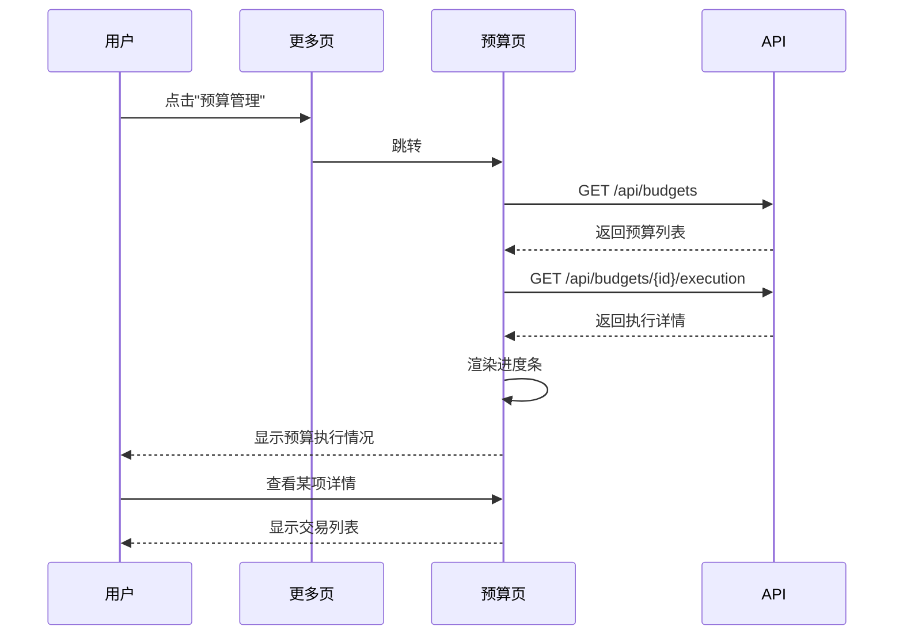

# BeanMind 前端页面设计

## 1. 设计原则

### 1.1 设计理念
- **移动优先**：基于 Framework7-Vue，针对移动端优化
- **iOS 风格**：采用 iOS 原生设计风格
- **简洁直观**：清晰的信息层级，易于操作
- **数据可视化**：图表展示财务数据

### 1.2 技术栈
- Vue 3 (Composition API)
- Framework7-Vue 8.x
- Pinia（状态管理）
- ECharts（图表）
- Axios（HTTP 客户端）

## 2. 导航结构

### 2.1 底部标签栏（Tab Bar）

```
┌─────────────────────────────────────────┐
│                                         │
│           页面内容区域                    │
│                                         │
├─────────────────────────────────────────┤
│  📊      💰      📁      📈      ⚙️    │
│ 仪表盘  记账   账户   分析   更多        │
└─────────────────────────────────────────┘
```

### 2.2 页面层级



## 3. 页面设计详情

### 3.1 登录页（Login Page）

**路由**：`/login`

**UI 元素**：
```
┌─────────────────────────────────────────┐
│                                         │
│          🏦 BeanMind                    │
│        个人财务管理助手                   │
│                                         │
│   ┌───────────────────────────────┐   │
│   │ 👤 用户名                      │   │
│   └───────────────────────────────┘   │
│                                         │
│   ┌───────────────────────────────┐   │
│   │ 🔒 密码                        │   │
│   └───────────────────────────────┘   │
│                                         │
│   ┌───────────────────────────────┐   │
│   │        登录                    │   │
│   └───────────────────────────────┘   │
│                                         │
└─────────────────────────────────────────┘
```

**功能**：
- 用户名/密码输入
- 登录验证
- Token 存储
- 自动跳转

**状态**：
- `loginForm.username`
- `loginForm.password`
- `loading`
- `errorMessage`

---

### 3.2 仪表盘（Dashboard）

**路由**：`/`

**UI 布局**：
```
┌─────────────────────────────────────────┐
│  BeanMind              👤 用户名  🔔    │
├─────────────────────────────────────────┤
│                                         │
│  💎 总资产概览                          │
│  ┌─────────────────────────────────┐  │
│  │  总资产  ¥150,000               │  │
│  │  总负债  ¥ 20,000               │  │
│  │  净资产  ¥130,000   📊         │  │
│  └─────────────────────────────────┘  │
│                                         │
│  💰 本月概览                            │
│  ┌─────────────────────────────────┐  │
│  │  收入    ¥15,000                │  │
│  │  支出    ¥ 3,250                │  │
│  │  结余    ¥11,750   📊          │  │
│  └─────────────────────────────────┘  │
│                                         │
│  📈 预算执行                            │
│  ┌─────────────────────────────────┐  │
│  │  餐饮    ▓▓▓▓▓░░░░░  43%       │  │
│  │  交通    ▓▓░░░░░░░░  25%       │  │
│  └─────────────────────────────────┘  │
│                                         │
│  🕐 最近交易                            │
│  ┌─────────────────────────────────┐  │
│  │  🍜 午餐          -¥45  今天   │  │
│  │  🚕 打车          -¥28  今天   │  │
│  │  💼 工资     +¥15,000  1/10    │  │
│  └─────────────────────────────────┘  │
│                                         │
│  ⚡️ 快捷操作                           │
│  [ + 支出 ] [ + 收入 ] [ + 转账 ]     │
│                                         │
└─────────────────────────────────────────┘
│  📊    💰    📁    📈    ⚙️           │
└─────────────────────────────────────────┘
```

**功能模块**：
1. **总资产概览卡片**
   - 总资产（所有资产账户余额之和）
   - 总负债（所有负债账户余额之和）
   - 净资产（总资产 - 总负债）
   - 点击查看账户列表详情

2. **本月财务概览卡片**
   - 本月收入/支出/结余
   - 点击查看详细统计

3. **预算执行进度**
   - 各预算项进度条
   - 颜色标识（正常/警告/超支）

4. **最近交易列表**
   - 显示最近5笔交易
   - 点击查看详情

5. **快捷操作按钮**
   - 快速添加支出/收入/转账

---

### 3.3 记账页（Transactions）

**路由**：`/transactions`

**UI 布局**：
```
┌─────────────────────────────────────────┐
│  < 交易记录           🔍  +新增        │
├─────────────────────────────────────────┤
│  [ 全部 ] [ 支出 ] [ 收入 ] [ 转账 ]  │
│                                         │
│  📅 2025年1月                           │
│  ┌─────────────────────────────────┐  │
│  │  1/15  🍜 午餐                  │  │
│  │        餐饮 > 就餐    -¥45.00  │  │
│  ├─────────────────────────────────┤  │
│  │  1/10  💼 工资收入              │  │
│  │        收入 > 工资  +¥15,000   │  │
│  ├─────────────────────────────────┤  │
│  │  1/05  🛒 超市购物              │  │
│  │        餐饮 > 食材   -¥235.50  │  │
│  └─────────────────────────────────┘  │
│                                         │
│  📅 2024年12月                          │
│  ┌─────────────────────────────────┐  │
│  │  ...                            │  │
│  └─────────────────────────────────┘  │
│                                         │
└─────────────────────────────────────────┘
│  📊    💰    📁    📈    ⚙️           │
└─────────────────────────────────────────┘
```

**功能**：
- 交易列表（虚拟滚动）
- 筛选（类型、日期、账户）
- 搜索
- 下拉刷新
- 上拉加载更多

**交易详情页**：
```
┌─────────────────────────────────────────┐
│  < 交易详情                    ⋯ 更多  │
├─────────────────────────────────────────┤
│                                         │
│              -¥45.00                    │
│             餐饮·就餐                    │
│                                         │
│  描述      午餐                         │
│  商家      公司楼下餐厅                  │
│  日期      2025-01-15 12:30            │
│  标签      #lunch #dining              │
│                                         │
│  分录详情                               │
│  ┌─────────────────────────────────┐  │
│  │  Expenses:Food:Dining           │  │
│  │                      +¥45.00    │  │
│  ├─────────────────────────────────┤  │
│  │  Assets:Cash:Wallet             │  │
│  │                      -¥45.00    │  │
│  └─────────────────────────────────┘  │
│                                         │
│  [ 编辑 ]          [ 删除 ]            │
│                                         │
└─────────────────────────────────────────┘
```

**新增交易页**：
```
┌─────────────────────────────────────────┐
│  < 新增交易                    ✓ 保存  │
├─────────────────────────────────────────┤
│  [ 支出 ] [ 收入 ] [ 转账 ]            │
│                                         │
│  金额      ¥                            │
│  ┌─────────────────────────────────┐  │
│  │         0.00                    │  │
│  └─────────────────────────────────┘  │
│                                         │
│  分类      餐饮 > 就餐            >    │
│  账户      现金钱包               >    │
│  日期      2025-01-15            >    │
│  描述      午餐                         │
│  商家      公司楼下餐厅                  │
│  标签      #lunch #dining              │
│                                         │
│  [ 快速金额 ]                          │
│  [ ¥10 ] [ ¥20 ] [ ¥50 ] [ ¥100 ]    │
│                                         │
└─────────────────────────────────────────┘
```

---

### 3.4 账户页（Accounts）

**路由**：`/accounts`

**UI 布局**：
```
┌─────────────────────────────────────────┐
│  账户管理                     +新增     │
├─────────────────────────────────────────┤
│                                         │
│  💰 资产账户          ¥31,000.00      │
│  ┌─────────────────────────────────┐  │
│  │  🏦 工商银行      ¥15,000.00    │  │
│  │  💳 支付宝        ¥ 5,000.00    │  │
│  │  💵 现金钱包      ¥ 1,000.00    │  │
│  └─────────────────────────────────┘  │
│                                         │
│  📊 收入账户                            │
│  ┌─────────────────────────────────┐  │
│  │  💼 工资收入                     │  │
│  │  🎁 奖金收入                     │  │
│  └─────────────────────────────────┘  │
│                                         │
│  📤 支出账户                            │
│  ┌─────────────────────────────────┐  │
│  │  🍜 餐饮美食                     │  │
│  │  🚗 交通出行                     │  │
│  │  🏠 住房租金                     │  │
│  │  🎬 休闲娱乐                     │  │
│  └─────────────────────────────────┘  │
│                                         │
└─────────────────────────────────────────┘
│  📊    💰    📁    📈    ⚙️           │
└─────────────────────────────────────────┘
```

**账户详情页**：
```
┌─────────────────────────────────────────┐
│  < 工商银行                    ⋯ 更多  │
├─────────────────────────────────────────┤
│                                         │
│          ¥15,000.00                     │
│         Assets:Bank:ICBC                │
│                                         │
│  📈 余额趋势                            │
│  ┌─────────────────────────────────┐  │
│  │       📊 折线图                 │  │
│  │                                 │  │
│  └─────────────────────────────────┘  │
│                                         │
│  📝 最近交易                            │
│  ┌─────────────────────────────────┐  │
│  │  1/15  转账到支付宝  -¥500     │  │
│  │  1/10  工资收入   +¥15,000     │  │
│  └─────────────────────────────────┘  │
│                                         │
└─────────────────────────────────────────┘
```

---

### 3.5 分析页（Analysis）

**路由**：`/analysis`

**UI 布局**：
```
┌─────────────────────────────────────────┐
│  数据分析              [ 2025-01 ▾ ]   │
├─────────────────────────────────────────┤
│                                         │
│  📊 收支趋势                            │
│  ┌─────────────────────────────────┐  │
│  │      📈 折线图/柱状图            │  │
│  │                                 │  │
│  └─────────────────────────────────┘  │
│                                         │
│  🥧 支出构成                            │
│  ┌─────────────────────────────────┐  │
│  │      🍩 饼图                    │  │
│  │                                 │  │
│  └─────────────────────────────────┘  │
│  餐饮 38%  交通 12%  住房 25%          │
│                                         │
│  🤖 AI 洞察                            │
│  ┌─────────────────────────────────┐  │
│  │  ⚠️ 本月餐饮支出偏高             │  │
│  │  建议减少外出就餐...            │  │
│  ├─────────────────────────────────┤  │
│  │  ✅ 储蓄率良好                  │  │
│  │  本月储蓄率78%...               │  │
│  └─────────────────────────────────┘  │
│                                         │
│  📋 财务报表                    >       │
│  💬 AI 助手                     >       │
│                                         │
└─────────────────────────────────────────┘
│  📊    💰    📁    📈    ⚙️           │
└─────────────────────────────────────────┘
```

**AI 助手页**：
```
┌─────────────────────────────────────────┐
│  < AI 财务助手                          │
├─────────────────────────────────────────┤
│  ┌─────────────────────────────────┐  │
│  │  🤖                             │  │
│  │  你好！我是你的财务助手，        │  │
│  │  有什么可以帮你的？              │  │
│  └─────────────────────────────────┘  │
│                                         │
│  ┌─────────────────────────────────┐  │
│  │                            👤   │  │
│  │  我这个月在餐饮上花了多少钱？    │  │
│  └─────────────────────────────────┘  │
│                                         │
│  ┌─────────────────────────────────┐  │
│  │  🤖                             │  │
│  │  您2025年1月在餐饮                │  │
│  │  (Expenses:Food:Dining)上        │  │
│  │  共花费¥856.50，包括15笔交易    │  │
│  └─────────────────────────────────┘  │
│                                         │
│  ┌───────────────────────────────┐    │
│  │  输入问题...              🎤  │    │
│  └───────────────────────────────┘    │
└─────────────────────────────────────────┘
```

---

### 3.6 更多页（More）

**路由**：`/more`

**UI 布局**：
```
┌─────────────────────────────────────────┐
│  更多                                   │
├─────────────────────────────────────────┤
│                                         │
│  财务管理                               │
│  ┌─────────────────────────────────┐  │
│  │  💰 预算管理              >     │  │
│  │  🔄 周期任务              >     │  │
│  └─────────────────────────────────┘  │
│                                         │
│  数据管理                               │
│  ┌─────────────────────────────────┐  │
│  │  💾 数据备份              >     │  │
│  │  📥 导入数据              >     │  │
│  │  📤 导出数据              >     │  │
│  └─────────────────────────────────┘  │
│                                         │
│  系统设置                               │
│  ┌─────────────────────────────────┐  │
│  │  ⚙️ 通用设置              >     │  │
│  │  🎨 外观主题              >     │  │
│  │  🔒 安全设置              >     │  │
│  └─────────────────────────────────┘  │
│                                         │
│  关于                                   │
│  ┌─────────────────────────────────┐  │
│  │  ℹ️ 关于 BeanMind         >     │  │
│  │  📖 使用帮助              >     │  │
│  └─────────────────────────────────┘  │
│                                         │
└─────────────────────────────────────────┘
│  📊    💰    📁    📈    ⚙️           │
└─────────────────────────────────────────┘
```

---

### 3.7 预算管理页

**路由**：`/budgets`

**UI 布局**：
```
┌─────────────────────────────────────────┐
│  < 预算管理                    +新增   │
├─────────────────────────────────────────┤
│                                         │
│  📅 2025年1月预算                       │
│  ┌─────────────────────────────────┐  │
│  │  总预算  ¥5,000                 │  │
│  │  已用    ¥1,856  (37%)          │  │
│  │  剩余    ¥3,144                 │  │
│  └─────────────────────────────────┘  │
│                                         │
│  预算明细                               │
│  ┌─────────────────────────────────┐  │
│  │  🍜 餐饮                        │  │
│  │  ¥2,000  ▓▓▓▓▓░░░░░  43%      │  │
│  │  已用 ¥856.50  剩余 ¥1,143.50  │  │
│  ├─────────────────────────────────┤  │
│  │  🚗 交通                        │  │
│  │  ¥500   ▓▓░░░░░░░░  25%       │  │
│  │  已用 ¥123    剩余 ¥377        │  │
│  ├─────────────────────────────────┤  │
│  │  🏠 住房                        │  │
│  │  ¥2,000  ░░░░░░░░░░  0%       │  │
│  │  已用 ¥0      剩余 ¥2,000      │  │
│  └─────────────────────────────────┘  │
│                                         │
└─────────────────────────────────────────┘
```

---

### 3.8 周期任务页

**路由**：`/recurring`

**UI 布局**：
```
┌─────────────────────────────────────────┐
│  < 周期任务                    +新增   │
├─────────────────────────────────────────┤
│                                         │
│  活跃任务                               │
│  ┌─────────────────────────────────┐  │
│  │  每月房租                      🔄│  │
│  │  按月: 每月1日 | ¥3,000         │  │
│  │  下次执行: 2025-02-01           │  │
│  ├─────────────────────────────────┤  │
│  │  每周健身                      🔄│  │
│  │  按周: 周一、周三、周五 | ¥200  │  │
│  │  下次执行: 2025-01-20           │  │
│  ├─────────────────────────────────┤  │
│  │  基金定投                      🔄│  │
│  │  按月: 每月5、15、25日 | ¥1000  │  │
│  │  下次执行: 2025-01-25           │  │
│  └─────────────────────────────────┘  │
│                                         │
│  已暂停                                 │
│  ┌─────────────────────────────────┐  │
│  │  视频会员                      ⏸ │  │
│  │  按月: 每月15日 | ¥30           │  │
│  └─────────────────────────────────┘  │
│                                         │
└─────────────────────────────────────────┘
```

**新增/编辑周期任务页面**：
```
┌─────────────────────────────────────────┐
│  < 新增周期任务                ✓ 保存  │
├─────────────────────────────────────────┤
│                                         │
│  规则名称                               │
│  ┌─────────────────────────────────┐  │
│  │  每周健身                       │  │
│  └─────────────────────────────────┘  │
│                                         │
│  频率类型                               │
│  [ 每日 ] [每周✓] [ 每月 ] [ 每年 ]   │
│                                         │
│  执行时间 (按周)                        │
│  ┌─────────────────────────────────┐  │
│  │  [ 一✓] [ 二 ] [三✓] [ 四 ]     │  │
│  │  [五✓] [ 六 ] [ 日 ]            │  │
│  └─────────────────────────────────┘  │
│                                         │
│  金额      ¥ 200                        │
│  分类      健身                    >    │
│  账户      支付宝                  >    │
│  开始日期  2025-01-01             >    │
│  结束日期  无限期                  >    │
│  描述      健身房消费                   │
│  商家      XX健身中心                   │
│                                         │
└─────────────────────────────────────────┘
```

**按月频率配置界面**：
```
┌─────────────────────────────────────────┐
│  选择每月执行日期                       │
├─────────────────────────────────────────┤
│                                         │
│  [ 1✓] [ 2 ] [ 3 ] [ 4 ] [ 5✓] [ 6 ]  │
│  [ 7 ] [ 8 ] [ 9 ] [10 ] [11 ] [12 ]  │
│  [13 ] [14 ] [15✓] [16 ] [17 ] [18 ]  │
│  [19 ] [20 ] [21 ] [22 ] [23 ] [24 ]  │
│  [25✓] [26 ] [27 ] [28 ] [29 ] [30 ]  │
│  [31 ] [月末✓]                         │
│                                         │
│  已选择: 1日、5日、15日、25日、月末      │
│                                         │
│  [ 确定 ]                [ 取消 ]      │
│                                         │
└─────────────────────────────────────────┘
```

---

### 3.9 数据备份页

**路由**：`/backup`

**UI 布局**：
```
┌─────────────────────────────────────────┐
│  < 数据备份                             │
├─────────────────────────────────────────┤
│                                         │
│  ┌─────────────────────────────────┐  │
│  │  [ 立即备份 ]                   │  │
│  └─────────────────────────────────┘  │
│                                         │
│  自动备份                               │
│  ┌─────────────────────────────────┐  │
│  │  启用自动备份          [ON]     │  │
│  │  备份频率           每天  >     │  │
│  │  备份提供者         GitHub >    │  │
│  └─────────────────────────────────┘  │
│                                         │
│  备份历史                               │
│  ┌─────────────────────────────────┐  │
│  │  ✅ 2025-01-15 12:00           │  │
│  │     GitHub | 1.2 MB      [ 恢复]│  │
│  ├─────────────────────────────────┤  │
│  │  ✅ 2025-01-14 12:00           │  │
│  │     GitHub | 1.1 MB      [ 恢复]│  │
│  └─────────────────────────────────┘  │
│                                         │
└─────────────────────────────────────────┘
```

## 4. 组件库设计

### 4.1 公共组件

#### 4.1.1 金额输入组件（AmountInput）
```vue
<template>
  <f7-list-input
    type="number"
    :value="displayAmount"
    @input="handleInput"
    :label="label"
    :placeholder="placeholder"
  >
    <template #media>{{ currency }}</template>
  </f7-list-input>
</template>
```

#### 4.1.2 账户选择器（AccountPicker）
```vue
<template>
  <f7-list-input
    type="select"
    :value="modelValue"
    @change="$emit('update:modelValue', $event.target.value)"
  >
    <option v-for="account in accounts" :key="account.name" :value="account.name">
      {{ account.display_name }}
    </option>
  </f7-list-input>
</template>
```

#### 4.1.3 日期选择器（DatePicker）
使用 Framework7 内置的日历组件

#### 4.1.4 分类选择器（CategoryPicker）
树形结构选择器

#### 4.1.5 预算进度条（BudgetProgressBar）
```vue
<template>
  <div class="budget-progress">
    <div class="progress-bar" :class="statusClass">
      <div class="progress-fill" :style="{ width: percentage + '%' }"></div>
    </div>
    <div class="progress-text">{{ percentage }}%</div>
  </div>
</template>
```

### 4.2 图表组件

使用 ECharts 封装：
- `LineChart` - 折线图（趋势）
- `PieChart` - 饼图（占比）
- `BarChart` - 柱状图（对比）

## 5. 状态管理（Pinia Stores）

### 5.1 authStore
```typescript
export const useAuthStore = defineStore('auth', {
  state: () => ({
    user: null,
    token: null,
    isAuthenticated: false,
  }),
  actions: {
    async login(username, password) {},
    async logout() {},
    async refreshToken() {},
  },
})
```

### 5.2 transactionStore
```typescript
export const useTransactionStore = defineStore('transaction', {
  state: () => ({
    transactions: [],
    filters: {},
    pagination: {},
  }),
  actions: {
    async fetchTransactions(params) {},
    async createTransaction(data) {},
    async updateTransaction(id, data) {},
    async deleteTransaction(id) {},
  },
})
```

### 5.3 accountStore
```typescript
export const useAccountStore = defineStore('account', {
  state: () => ({
    accounts: [],
    accountTree: [],
  }),
  actions: {
    async fetchAccounts() {},
    async getAccountBalance(accountName) {},
  },
})
```

### 5.4 budgetStore、recurringStore、backupStore、analysisStore
类似结构

## 6. 用户流程示例

### 6.1 添加支出流程



### 6.2 查看预算执行流程



## 7. 响应式设计

### 7.1 断点策略
- 移动端：< 768px（主要适配）
- 平板：768px - 1024px
- 桌面：> 1024px（可选支持）

### 7.2 适配方案
- Framework7 自带响应式布局
- 使用 rem 单位
- 弹性布局（Flexbox）

## 8. 性能优化

### 8.1 列表优化
- 虚拟滚动（长列表）
- 分页加载
- 骨架屏

### 8.2 图表优化
- 按需加载 ECharts
- 图表数据缓存
- 防抖/节流

### 8.3 路由优化
- 懒加载路由组件
- 预加载关键路由

## 9. 主题定制

### 9.1 颜色方案
```css
:root {
  --f7-theme-color: #007aff;       /* iOS 蓝 */
  --f7-theme-color-shade: #0062cc;
  --f7-theme-color-tint: #5ab2ff;
  
  --success-color: #34c759;        /* 成功绿 */
  --warning-color: #ff9500;        /* 警告橙 */
  --danger-color: #ff3b30;         /* 危险红 */
  
  --income-color: #34c759;         /* 收入 */
  --expense-color: #ff3b30;        /* 支出 */
}
```

### 9.2 暗黑模式
```css
.dark {
  --f7-page-bg-color: #000;
  --f7-text-color: #fff;
  /* ... */
}
```

## 10. 国际化（可选）

预留国际化接口，支持中英文切换：
```javascript
const messages = {
  'zh-CN': {
    dashboard: '仪表盘',
    transactions: '记账',
    // ...
  },
  'en-US': {
    dashboard: 'Dashboard',
    transactions: 'Transactions',
    // ...
  },
}
```
