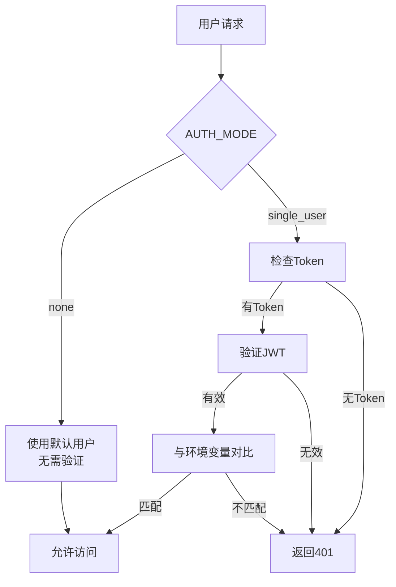
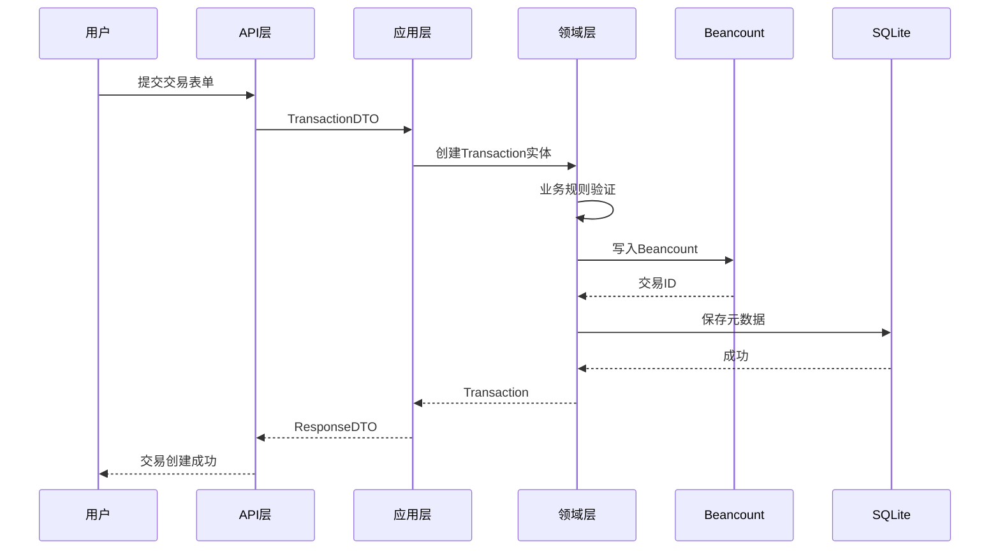
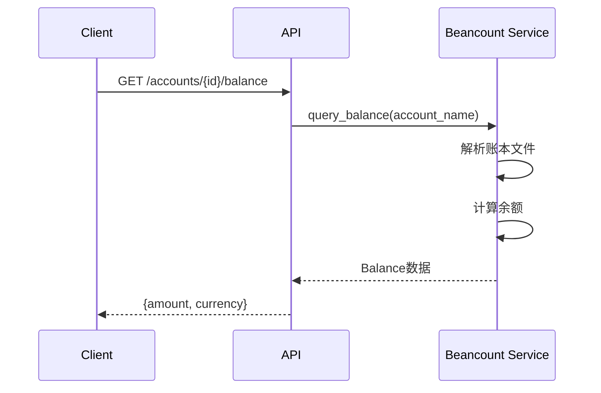
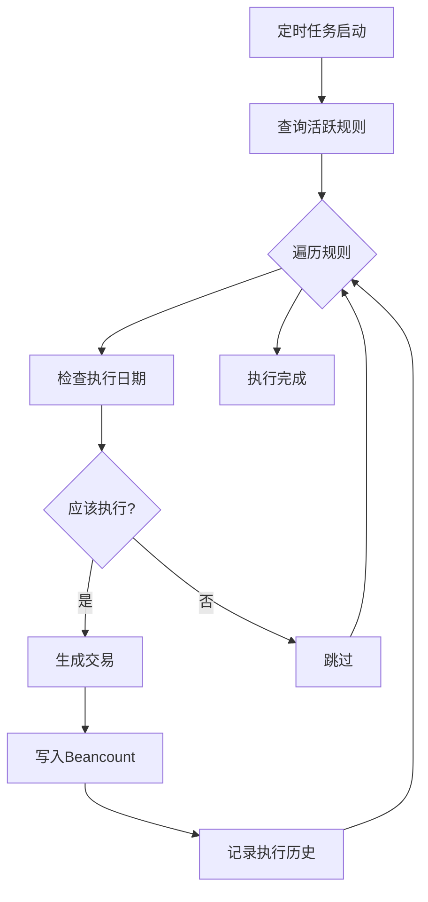
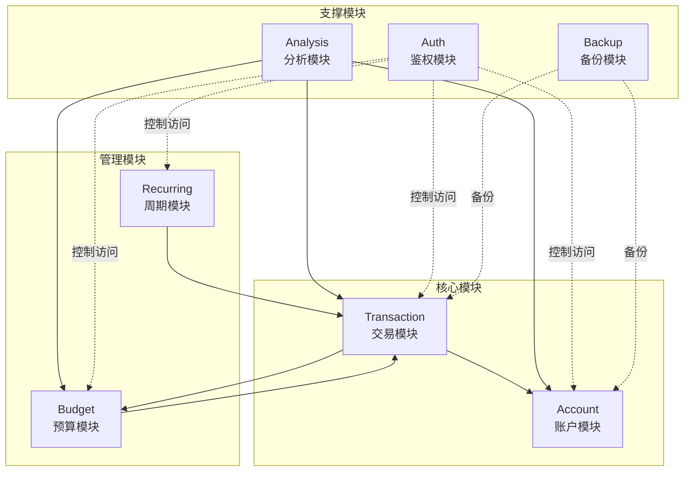

# BeanMind 功能模块设计

## 1. 鉴权模块（Auth Module）

### 1.1 功能概述
支持灵活的鉴权策略，通过环境变量配置单用户或无用户模式。

### 1.2 核心流程



### 1.3 接口设计
- `POST /api/auth/login` - 登录获取Token（单用户模式）
- `POST /api/auth/refresh` - 刷新Token
- `GET /api/auth/me` - 获取当前用户信息

### 1.4 环境变量
```bash
AUTH_MODE=none  # none | single_user
SINGLE_USER_USERNAME=admin
SINGLE_USER_PASSWORD=password
JWT_SECRET_KEY=your-secret-key
JWT_EXPIRATION_HOURS=24
```

## 2. 记账模块（Transaction Module）

### 2.1 功能概述
核心记账功能，支持收入、支出、转账等交易类型。

### 2.2 交易类型

| 类型 | 说明 | 账户组合 |
|------|------|----------|
| 支出 | 日常消费 | Expenses → Assets |
| 收入 | 工资等收入 | Assets ← Income |
| 转账 | 账户间转移 | Assets → Assets |
| 还款 | 信用卡还款 | Liabilities → Assets |

### 2.3 创建交易流程



### 2.4 业务规则
1. **借贷平衡**：所有分录金额总和必须为0
2. **账户存在性**：使用的账户必须已在Beancount中open
3. **币种一致性**：单个交易内同一账户的币种必须一致
4. **日期合理性**：交易日期不能早于账户开立日期

### 2.5 核心功能
- 创建交易（支出/收入/转账）
- 查询交易列表（支持筛选、分页）
- 更新交易
- 删除交易
- 交易统计（按类别、时间）

## 3. 账户管理模块（Account Module）

### 3.1 功能概述
管理资产、负债、收入、支出等各类账户。

### 3.2 账户层级结构

```
Assets (资产)
├── Cash (现金)
│   └── Wallet (钱包)
├── Bank (银行)
│   ├── ICBC (工商银行)
│   └── CMB (招商银行)
└── Investment (投资)
    └── Alipay (支付宝)

Expenses (支出)
├── Food (食品)
│   ├── Dining (餐饮)
│   └── Groceries (食材)
└── Transport (交通)
    ├── PublicTransit (公交)
    └── Taxi (打车)
```

### 3.3 核心功能
- 创建账户（自动写入Beancount）
- 查询账户列表（树形结构）
- 获取账户余额
- 账户历史统计
- 关闭账户

### 3.4 账户余额查询



## 4. 预算管理模块（Budget Module）

### 4.1 功能概述
设置并追踪预算执行情况，提供预算预警。

### 4.2 预算周期类型
- **月度预算**：每月1日开始
- **年度预算**：每年1月1日开始
- **自定义周期**：指定开始和结束日期

### 4.3 预算结构

```json
{
  "id": "uuid",
  "name": "2025年1月预算",
  "period_type": "MONTHLY",
  "start_date": "2025-01-01",
  "end_date": "2025-01-31",
  "items": [
    {
      "account_pattern": "Expenses:Food:*",
      "amount": 2000,
      "currency": "CNY",
      "spent": 856.5
    },
    {
      "account_pattern": "Expenses:Transport:*",
      "amount": 500,
      "currency": "CNY",
      "spent": 123.0
    }
  ]
}
```

### 4.4 预算执行计算

```python
def calculate_budget_execution(budget_item: BudgetItem, 
                               transactions: List[Transaction]) -> BudgetExecution:
    """计算预算执行情况"""
    spent = sum(
        t.amount for t in transactions 
        if matches_pattern(t.account, budget_item.account_pattern)
    )
    
    remaining = budget_item.amount - spent
    percentage = (spent / budget_item.amount) * 100
    
    status = "NORMAL"
    if percentage >= 100:
        status = "EXCEEDED"
    elif percentage >= 80:
        status = "WARNING"
    
    return BudgetExecution(
        spent=spent,
        remaining=remaining,
        percentage=percentage,
        status=status
    )
```

### 4.5 核心功能
- 创建预算
- 查询预算列表
- 查看预算执行情况
- 预算预警（超过80%、100%）
- 更新/删除预算

## 5. 周期记账模块（Recurring Module）

### 5.1 功能概述
自动化处理固定周期的交易，如房租、订阅等。

### 5.2 频率类型

支持灵活的周期配置，满足各种定期交易需求：

#### 5.2.1 每日（DAILY）
- **配置**：无需额外配置
- **执行**：每天执行一次
- **示例**：每日健身打卡消费

#### 5.2.2 按周（WEEKLY）
- **配置**：指定星期几执行（可多选）
  - `weekdays`: `[1, 3, 5]` 表示周一、周三、周五
  - 取值范围：1-7（1=周一，7=周日）
- **执行**：在指定的星期几执行
- **示例**：
  - 每周一、周三健身房会费（`weekdays: [1, 3]`）
  - 每周末外出就餐（`weekdays: [6, 7]`）

#### 5.2.3 按月（MONTHLY）
- **配置**：指定每月的哪几天执行（可多选）
  - `month_days`: `[1, 15]` 表示每月1日和15日
  - 取值范围：1-31
  - 特殊值：`-1` 表示最后一天，`-2` 表示倒数第二天
- **执行**：在指定的日期执行
- **注意**：如果指定日期不存在（如2月30日），自动跳过
- **示例**：
  - 每月1日房租（`month_days: [1]`）
  - 每月15日和月底还信用卡（`month_days: [15, -1]`）
  - 每月5日、15日、25日定投（`month_days: [5, 15, 25]`）

#### 5.2.4 按年（YEARLY）
- **配置**：指定每年的哪一天执行
  - `month`: 月份（1-12）
  - `day`: 日期（1-31）
- **执行**：每年在指定日期执行
- **示例**：
  - 每年1月1日保险费（`month: 1, day: 1`）
  - 每年6月18日年度会员续费（`month: 6, day: 18`）

#### 5.2.5 自定义间隔（INTERVAL）
- **配置**：指定间隔天数
  - `interval_days`: 间隔天数
- **执行**：从开始日期起，每隔 N 天执行
- **示例**：
  - 每3天一次的定期消费（`interval_days: 3`）
  - 每10天采购一次（`interval_days: 10`）

### 5.3 周期规则示例

#### 示例1：每月房租（按月-单日）
```json
{
  "id": "uuid",
  "name": "每月房租",
  "frequency": "MONTHLY",
  "frequency_config": {
    "month_days": [1]
  },
  "start_date": "2025-01-01",
  "end_date": null,
  "transaction_template": {
    "description": "房租",
    "payee": "房东张三",
    "postings": [
      {"account": "Expenses:Housing:Rent", "amount": 3000, "currency": "CNY"},
      {"account": "Assets:Bank:ICBC", "amount": -3000, "currency": "CNY"}
    ],
    "tags": ["rent", "recurring"]
  },
  "is_active": true
}
```

#### 示例2：每周健身（按周-多日）
```json
{
  "id": "uuid",
  "name": "每周健身",
  "frequency": "WEEKLY",
  "frequency_config": {
    "weekdays": [1, 3, 5]  // 周一、周三、周五
  },
  "start_date": "2025-01-01",
  "transaction_template": {
    "description": "健身房",
    "payee": "XX健身中心",
    "postings": [
      {"account": "Expenses:Health:Fitness", "amount": 50, "currency": "CNY"},
      {"account": "Assets:Invest:Alipay", "amount": -50, "currency": "CNY"}
    ],
    "tags": ["fitness", "recurring"]
  },
  "is_active": true
}
```

#### 示例3：每月定投（按月-多日）
```json
{
  "id": "uuid",
  "name": "基金定投",
  "frequency": "MONTHLY",
  "frequency_config": {
    "month_days": [5, 15, 25]  // 每月5日、15日、25日
  },
  "start_date": "2025-01-01",
  "transaction_template": {
    "description": "基金定投",
    "payee": "天天基金",
    "postings": [
      {"account": "Assets:Investment:Fund", "amount": 1000, "currency": "CNY"},
      {"account": "Assets:Bank:ICBC", "amount": -1000, "currency": "CNY"}
    ],
    "tags": ["investment", "recurring"]
  },
  "is_active": true
}
```

#### 示例4：信用卡还款（按月-月中+月末）
```json
{
  "id": "uuid",
  "name": "信用卡还款",
  "frequency": "MONTHLY",
  "frequency_config": {
    "month_days": [15, -1]  // 15日和最后一天
  },
  "transaction_template": {
    "description": "信用卡还款",
    "payee": "工商银行",
    "postings": [
      {"account": "Liabilities:CreditCard:ICBC", "amount": -5000, "currency": "CNY"},
      {"account": "Assets:Bank:ICBC", "amount": 5000, "currency": "CNY"}
    ],
    "tags": ["creditcard", "recurring"]
  },
  "is_active": true
}
```

### 5.4 自动执行流程



### 5.5 核心功能
- 创建周期规则
- 查询规则列表
- 手动执行规则
- 查看执行历史
- 暂停/恢复规则
- 删除规则

## 6. 数据备份模块（Backup Module）

### 6.1 功能概述
提供可插拔的备份机制，支持多种备份提供者。

### 6.2 备份提供者

#### 6.2.1 GitHub Provider
```python
class GitHubBackupProvider(BackupProvider):
    def __init__(self, repo: str, token: str, branch: str = "main"):
        self.repo = repo
        self.token = token
        self.branch = branch
    
    async def backup(self, files: List[Path]) -> BackupResult:
        """推送到GitHub仓库"""
        # 1. 克隆或拉取仓库
        # 2. 复制文件到仓库
        # 3. 提交并推送
        pass
```

#### 6.2.2 Local Provider
```python
class LocalBackupProvider(BackupProvider):
    def __init__(self, backup_dir: Path):
        self.backup_dir = backup_dir
    
    async def backup(self, files: List[Path]) -> BackupResult:
        """复制到本地目录，按时间戳命名"""
        timestamp = datetime.now().strftime("%Y%m%d_%H%M%S")
        backup_path = self.backup_dir / f"backup_{timestamp}"
        # 复制文件
        pass
```

### 6.3 备份配置

```bash
# .env
BACKUP_PROVIDER=github  # github | local | s3
BACKUP_AUTO_ENABLED=true
BACKUP_AUTO_INTERVAL=daily  # hourly | daily | weekly

# GitHub配置
GITHUB_REPO=username/beanmind-backup
GITHUB_TOKEN=ghp_xxxxx
GITHUB_BRANCH=main

# 本地配置
LOCAL_BACKUP_DIR=/Users/xxx/backups
```

### 6.4 核心功能
- 手动备份
- 自动备份（定时任务）
- 查看备份历史
- 恢复备份
- 删除备份

## 7. AI 分析模块（Analysis Module）

### 7.1 功能概述
基于 AgentUniverse 框架提供智能财务分析和建议。

### 7.2 分析类型

#### 7.2.1 消费模式分析
```python
async def analyze_spending_pattern(
    transactions: List[Transaction],
    period: DateRange
) -> SpendingPattern:
    """分析消费模式"""
    # 1. 按类别统计支出
    # 2. 识别异常支出
    # 3. 发现消费趋势
    # 4. 生成可视化数据
    pass
```

#### 7.2.2 预算建议
```python
async def generate_budget_advice(
    historical_data: FinancialHistory,
    user_goals: UserGoals
) -> BudgetAdvice:
    """AI生成预算建议"""
    # 调用AgentUniverse Agent
    # 基于历史数据和目标生成建议
    pass
```

#### 7.2.3 财务健康评分
```python
async def calculate_financial_health(
    user_data: UserFinancialData
) -> HealthScore:
    """评估财务健康度"""
    # 1. 收支比
    # 2. 储蓄率
    # 3. 负债率
    # 4. 消费结构合理性
    pass
```

### 7.3 AgentUniverse 集成

```python
from agentuniverse import Agent, Tool

class FinancialAnalysisAgent(Agent):
    """财务分析智能体"""
    
    @Tool
    def get_spending_summary(self, params: dict) -> dict:
        """获取支出摘要"""
        pass
    
    @Tool
    def suggest_budget_optimization(self, params: dict) -> str:
        """建议预算优化"""
        pass
```

### 7.4 核心功能
- 生成财务报表（月报/年报）
- 消费趋势分析
- 异常支出检测
- AI 预算建议
- 财务健康评分
- 自然语言查询

## 8. 模块间协作



## 9. 扩展点设计

### 9.1 备份提供者扩展
```python
# 新增云存储提供者
class S3BackupProvider(BackupProvider):
    """AWS S3备份实现"""
    pass

# 注册到容器
container.backup_provider.add_provider("s3", S3BackupProvider)
```

### 9.2 AI 分析扩展
```python
# 新增分析类型
class InvestmentAnalyzer(Analyzer):
    """投资分析器"""
    async def analyze(self, data: InvestmentData) -> AnalysisResult:
        pass
```

### 9.3 通知渠道扩展
```python
# 预算预警通知
class NotificationChannel(ABC):
    @abstractmethod
    async def send(self, message: str):
        pass

class EmailNotificationChannel(NotificationChannel):
    """邮件通知"""
    pass

class WeChatNotificationChannel(NotificationChannel):
    """微信通知"""
    pass
```
