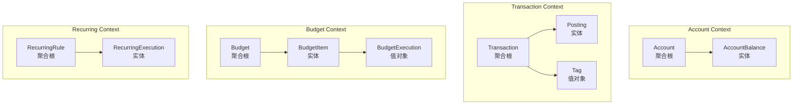
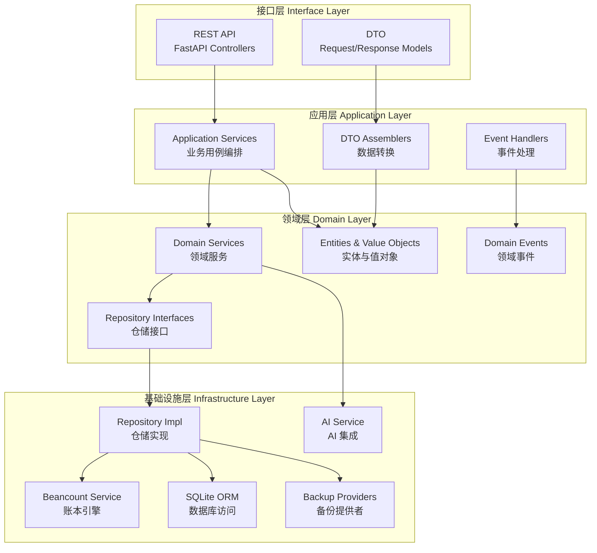
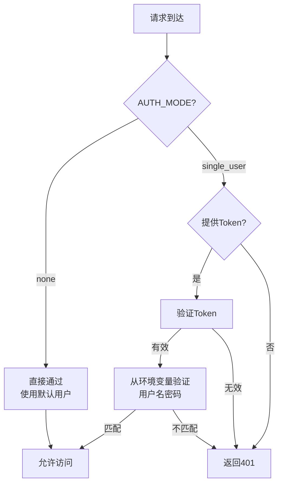
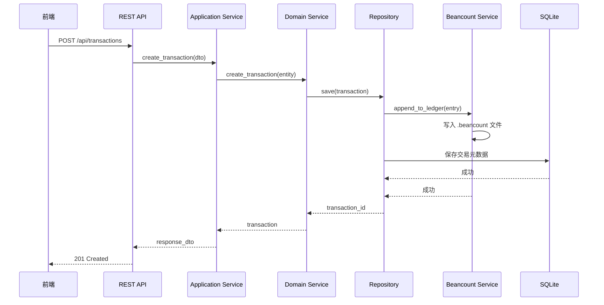
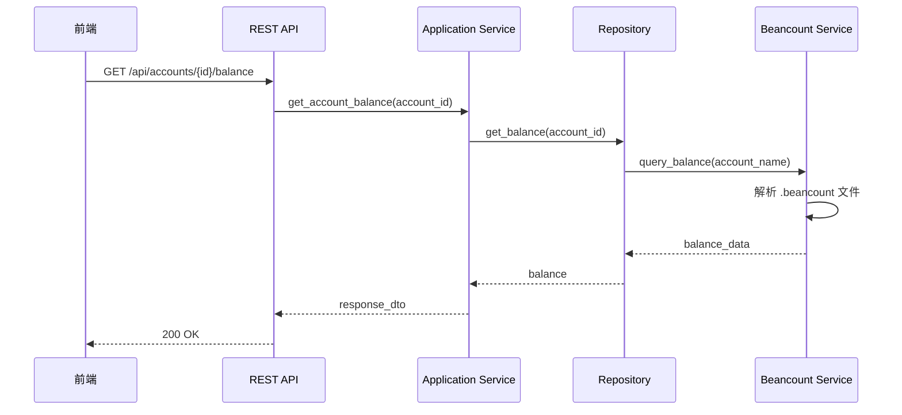

# BeanMind 系统架构设计

## 1. 技术栈

### 1.1 后端技术栈
- **语言**: Python 3.10+
- **Web 框架**: FastAPI（高性能异步框架）
- **账本引擎**: Beancount
- **数据库**: SQLite
- **AI 框架**: AgentUniverse
- **ORM**: SQLAlchemy
- **数据验证**: Pydantic
- **依赖注入**: Python Dependency Injector

### 1.2 前端技术栈
- **框架**: Vue 3（Composition API）
- **UI 框架**: Framework7-Vue（移动端 UI）
- **状态管理**: Pinia
- **HTTP 客户端**: Axios
- **构建工具**: Vite

### 1.3 数据存储
- **账本数据**: Beancount 文本文件（`data/ledger/`）
- **业务数据**: SQLite（`data/beanmind.db`）
- **备份**: 支持 GitHub、本地文件等可插拔方式

## 2. DDD 领域模型设计

### 2.1 限界上下文（Bounded Context）

#### 2.1.1 账户上下文（Account Context）
**核心概念**：账户、账户类型、账户余额
- 管理资产、负债、权益、收入、费用等账户
- 追踪账户余额变化
- 提供账户层级结构

#### 2.1.2 交易上下文（Transaction Context）
**核心概念**：交易、分录、标签
- 记录收入、支出、转账等交易
- 支持多币种交易
- 管理交易标签和分类

#### 2.1.3 预算上下文（Budget Context）
**核心概念**：预算、预算周期、预算执行
- 设置月度/年度预算
- 追踪预算执行情况
- 预算预警机制

#### 2.1.4 周期任务上下文（Recurring Context）
**核心概念**：周期规则、自动记账
- 定义周期性交易规则
- 自动生成周期交易
- 管理订阅和固定支出

#### 2.1.5 认证上下文（Auth Context）
**核心概念**：用户、会话、权限
- 单用户/无用户模式
- 环境变量配置鉴权
- Token 管理

#### 2.1.6 备份上下文（Backup Context）
**核心概念**：备份策略、备份历史
- 可插拔备份提供者
- 自动/手动备份
- 备份恢复

#### 2.1.7 分析上下文（Analysis Context）
**核心概念**：报表、趋势、AI 洞察
- 财务报表生成
- 消费趋势分析
- AI 驱动的财务建议

### 2.2 聚合根（Aggregate Root）



## 3. 系统分层架构

### 3.1 架构概览



### 3.2 目录结构设计

```
BeanMind/
├── backend/                          # 后端代码
│   ├── main.py                       # 应用入口
│   ├── config/                       # 配置管理
│   │   ├── settings.py               # 环境变量配置
│   │   └── container.py              # 依赖注入容器
│   ├── interfaces/                   # 接口层
│   │   ├── api/                      # REST API
│   │   │   ├── auth.py               # 认证接口
│   │   │   ├── transactions.py       # 交易接口
│   │   │   ├── accounts.py           # 账户接口
│   │   │   ├── budgets.py            # 预算接口
│   │   │   ├── recurring.py          # 周期任务接口
│   │   │   ├── backup.py             # 备份接口
│   │   │   └── analysis.py           # 分析接口
│   │   └── dto/                      # 数据传输对象
│   │       ├── request/              # 请求 DTO
│   │       └── response/             # 响应 DTO
│   ├── application/                  # 应用层
│   │   ├── services/                 # 应用服务
│   │   │   ├── auth_service.py
│   │   │   ├── transaction_service.py
│   │   │   ├── account_service.py
│   │   │   ├── budget_service.py
│   │   │   ├── recurring_service.py
│   │   │   ├── backup_service.py
│   │   │   └── analysis_service.py
│   │   ├── assemblers/               # DTO 转换器
│   │   └── handlers/                 # 事件处理器
│   ├── domain/                       # 领域层
│   │   ├── auth/                     # 认证领域
│   │   │   ├── entities/
│   │   │   ├── value_objects/
│   │   │   ├── services/
│   │   │   └── repositories/
│   │   ├── account/                  # 账户领域
│   │   ├── transaction/              # 交易领域
│   │   ├── budget/                   # 预算领域
│   │   ├── recurring/                # 周期任务领域
│   │   ├── backup/                   # 备份领域
│   │   └── analysis/                 # 分析领域
│   └── infrastructure/               # 基础设施层
│       ├── persistence/              # 持久化
│       │   ├── sqlalchemy/           # SQLAlchemy 实现
│       │   │   ├── models/           # ORM 模型
│       │   │   └── repositories/     # 仓储实现
│       │   └── beancount/            # Beancount 集成
│       │       └── beancount_service.py
│       ├── backup/                   # 备份实现
│       │   ├── provider_interface.py # 备份提供者接口
│       │   ├── github_provider.py    # GitHub 备份
│       │   └── local_provider.py     # 本地备份
│       └── ai/                       # AI 集成
│           └── agent_universe_service.py
├── frontend/                         # 前端代码
│   ├── src/
│   │   ├── main.js                   # Vue 应用入口
│   │   ├── App.vue                   # 根组件
│   │   ├── router/                   # 路由配置
│   │   ├── stores/                   # Pinia 状态管理
│   │   ├── api/                      # API 客户端
│   │   ├── components/               # 公共组件
│   │   └── pages/                    # 页面组件
│   │       ├── auth/                 # 认证页面
│   │       ├── dashboard/            # 仪表盘
│   │       ├── transactions/         # 交易管理
│   │       ├── accounts/             # 账户管理
│   │       ├── budgets/              # 预算管理
│   │       ├── recurring/            # 周期任务
│   │       ├── backup/               # 备份管理
│   │       └── analysis/             # 数据分析
│   ├── package.json
│   └── vite.config.js
├── data/                             # 数据目录
│   ├── ledger/                       # Beancount 账本文件
│   │   └── main.beancount            # 主账本文件
│   └── beanmind.db                   # SQLite 数据库
├── .env.example                      # 环境变量示例
├── requirements.txt                  # Python 依赖
└── README.md                         # 项目说明
```

## 4. 鉴权系统设计

### 4.1 鉴权模式

通过环境变量配置支持三种模式：

```python
# .env 配置示例
AUTH_MODE=none|single_user|multi_user  # 默认: single_user
SINGLE_USER_USERNAME=admin             # 单用户模式用户名
SINGLE_USER_PASSWORD=password          # 单用户模式密码
JWT_SECRET_KEY=your-secret-key         # JWT 密钥
JWT_EXPIRATION_HOURS=24                # Token 过期时间
```

### 4.2 鉴权流程



### 4.3 默认用户

```python
DEFAULT_USER = {
    "id": "00000000-0000-0000-0000-000000000000",
    "username": "default",
    "display_name": "默认用户"
}
```

## 5. 数据流转

### 5.1 写入流程（新增交易）



### 5.2 查询流程（获取账户余额）



## 6. 可扩展性设计

### 6.1 备份提供者插件机制

```python
# 抽象接口
class BackupProvider(ABC):
    @abstractmethod
    async def backup(self, files: List[Path]) -> BackupResult:
        """执行备份"""
        pass
    
    @abstractmethod
    async def restore(self, backup_id: str, target_dir: Path) -> RestoreResult:
        """恢复备份"""
        pass
    
    @abstractmethod
    async def list_backups(self) -> List[BackupInfo]:
        """列出备份历史"""
        pass

# 实现示例
class GitHubBackupProvider(BackupProvider):
    """GitHub 备份实现"""
    pass

class LocalBackupProvider(BackupProvider):
    """本地文件备份实现"""
    pass

# 未来可扩展
class S3BackupProvider(BackupProvider):
    """AWS S3 备份实现"""
    pass
```

### 6.2 AI 分析插件机制

```python
class AnalysisProvider(ABC):
    @abstractmethod
    async def analyze_spending_pattern(self, transactions: List[Transaction]) -> AnalysisResult:
        """分析消费模式"""
        pass
    
    @abstractmethod
    async def generate_budget_advice(self, context: FinancialContext) -> str:
        """生成预算建议"""
        pass
```

### 6.3 依赖注入配置

```python
# container.py
from dependency_injector import containers, providers

class Container(containers.DeclarativeContainer):
    config = providers.Configuration()
    
    # 基础设施
    beancount_service = providers.Singleton(BeancountService)
    db_session = providers.Singleton(get_db_session)
    
    # 备份提供者（可配置）
    backup_provider = providers.Selector(
        config.backup.provider,
        github=providers.Singleton(GitHubBackupProvider),
        local=providers.Singleton(LocalBackupProvider),
    )
    
    # 仓储
    transaction_repository = providers.Factory(
        TransactionRepository,
        beancount_service=beancount_service,
        db_session=db_session,
    )
    
    # 应用服务
    transaction_service = providers.Factory(
        TransactionService,
        repository=transaction_repository,
    )
```

## 7. 性能优化策略

### 7.1 Beancount 文件缓存
- 启动时加载并解析账本文件
- 监听文件变化，增量更新缓存
- 提供内存中的快速查询

### 7.2 SQLite 索引策略
- 交易日期索引
- 账户 ID 索引
- 标签索引
- 用户 ID 索引（多用户模式）

### 7.3 前端优化
- 虚拟滚动（大量交易列表）
- 分页加载
- 数据缓存（Pinia）
- 懒加载路由

## 8. 安全性设计

### 8.1 认证安全
- JWT Token 机制
- Token 刷新策略
- 密码 bcrypt 加密（如扩展多用户）

### 8.2 数据安全
- SQLite 数据库加密（可选）
- 敏感配置环境变量管理
- 备份数据加密（GitHub Private Repo）

### 8.3 API 安全
- CORS 配置
- 请求频率限制
- 输入验证（Pydantic）
- SQL 注入防护（ORM）
